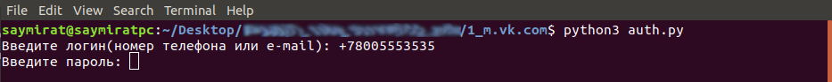

### Python-скрипт для аутентификации на m.vk.com

* **auth.py** - исполнительный файл;
* **vk.txt** - текстовый файл; создается при запуске скрипта для получения токена и прочих полей формы входа;

Команда для запуска скрипта в консоли:
> \> **python3 auth.py**

Скрипт предлагает ввод логина (e-mail/номер мобильного телефона) и пароля:

Успешная аутентификация выведет в консоль html-контент ответной страницы.